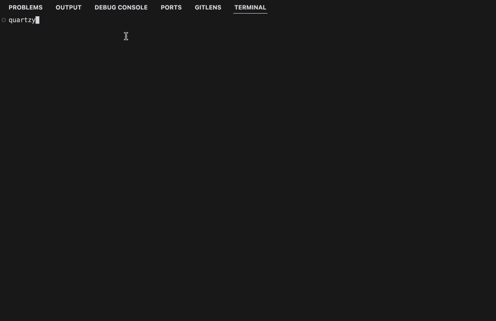

# Quartzy

Quartzy is a macOS command-line tool designed to record audio, convert it to a different format, and transcribe the audio using OpenAI's transcription service. It also simulates keyboard input with the transcription result.

## Features

- Record audio using a selected input device.
- Convert recorded audio from AIFF to WAV format.
- Transcribe audio using OpenAI's Whisper model.
- Simulate keyboard input with the transcription result.

<p style="border: 3px solid green; display: inline-block;">
  
</p>

## Prerequisites

Before installing and running Quartzy, ensure you have the following dependencies installed on your system:

### macOS Dependencies

1. **Homebrew**: If you don't have Homebrew installed, you can install it by running:
   ```sh
   /bin/bash -c "$(curl -fsSL https://raw.githubusercontent.com/Homebrew/install/HEAD/install.sh)"
   ```
2. **PortAudio**: Install PortAudio using Homebrew (required for recording audio):
   ```sh
   brew install portaudio
   ```
3. **Xcode Command Line Tools**: Install Xcode command line tools (required for the robotgo package to control your keyboard):
   ```sh
   xcode-select --install
   ```

## Installation

1. **Clone the Repository**:
   ```sh
   git clone https://github.com/yourusername/quartzy.git
   cd quartzy
   ```
2. **Set Up Environment Variables**:
   Create a `local.env` file in the root directory and add your OpenAI API key:
   ```env
   echo "OPENAI_API_KEY=your_openai_api_key_here" > local.env
   ```

## Usage

1. **Install the Application**:
   ```sh
   go install
   ```

2. **Run the Application**:
   You can run Quartzy with an optional output directory path:
   ```sh
   quartzy [optional: output directory path]
   ```
   If no directory is specified, it defaults to `recordings`.

### Recording

- The application will list available audio input devices.
- Select a device by entering its index.
- Press `Ctrl-R` to stop the recording.

### Transcription

- The recorded audio is converted to WAV format.
- The WAV file is uploaded to OpenAI for transcription.
- The transcription result is simulated as keyboard input.

## License

This project is licensed under the MIT License. See the LICENSE file for details.

## Contributing

Contributions are welcome! Please fork the repository and submit a pull request for any improvements or bug fixes.

---

This README provides a comprehensive overview of what Quartzy does, how to install it, and how to run it, including the necessary dependencies for macOS. Adjust the repository URL and any other specific details as needed for your project.
